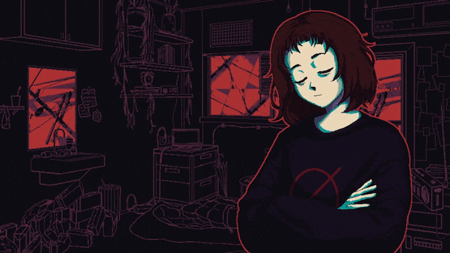

# Milk Inside a Bag of Milk — Spicetify Theme

A Spicetify theme inspired by the game [Milk inside a bag of milk inside a bag of milk](https://store.steampowered.com/app/1392820/Milk_inside_a_bag_of_milk_inside_a_bag_of_milk/) by Nikita Kryukov.



## Requirements

- **Spotify** (installed directly from the official website — see warning below)
- **Spicetify**
- **Git** (to clone this repo)

# How You Install Spotify Matters

**You must download Spotify directly from [spotify.com/download](https://www.spotify.com/download).**

If you installed Spotify from a package manager (Snap, Flatpak, AUR, etc.), Spicetify will likely **not work correctly** or will break after updates. This is because those versions restrict file access in ways that Spicetify depends on.

If you are on Linux, download the `.deb` package from the official site and install it with:

```bash
sudo dpkg -i spotify-client.deb
```

## Step 1 — Install Spicetify

### Windows

Open PowerShell and run:

```powershell
iwr -useb https://raw.githubusercontent.com/spicetify/cli/main/install.ps1 | iex
```

### Linux / macOS

Open a terminal and run:

```bash
curl -fsSL https://raw.githubusercontent.com/spicetify/cli/main/install.sh | sh
```

After installation, run this to let Spicetify find your Spotify installation:

```bash
spicetify
```

If it says "command not found", add Spicetify to your PATH. On Linux/macOS add this to your `~/.bashrc` or `~/.zshrc`:

```bash
export PATH="$HOME/.spicetify:$PATH"
```

Then reload your terminal:

```bash
source ~/.bashrc
```

## Step 2 — Clone this repo into Spicetify's Themes folder

### Linux / macOS

```bash
cd ~/.spicetify/Themes
git clone https://github.com/Lucbro99/Spicetify-milk-background
```

### Windows

```powershell
cd "$env:APPDATA\spicetify\Themes"
git clone https://github.com/Lucbro99/Spicetify-milk-background
```

## Step 3 — Copy the extension

The background GIF is injected by a JavaScript extension. Copy it to Spicetify's Extensions folder.

### Linux / macOS

```bash
cp ~/.spicetify/Themes/Spicetify-milk-background/milk-bg.js ~/.spicetify/Extensions/
```

### Windows

```powershell
cp "$env:APPDATA\spicetify\Themes\Spicetify-milk-background\milk-bg.js" "$env:APPDATA\spicetify\Extensions\"
```

## Step 4 — Apply the theme

Run these commands:

```bash
spicetify config current_theme Spicetify-milk-background
spicetify config color_scheme Base
spicetify config extensions milk-bg.js
spicetify apply
```

Spotify will relaunch with the theme active.

## File structure

```
Spicetify-milk-background/
├── assets/
│   ├── Milk.gif            # Animated background
│   ├── Milk.png            # Static version of the background
│   ├── play.jpg            # Custom play/pause button image
│   ├── back-button.jpg     # Custom skip back button image
│   └── forward-button.jpg  # Custom skip forward button image
├── color.ini               # Color palette (reds, cyans, dark backgrounds)
├── user.css                # All visual styles and layout overrides
├── milk-bg.js              # Extension that injects the GIF background
└── theme.js                # Replaces Spotify default images and icons
```

## Customization

### Change background opacity

Open `user.css` and find this line inside `.Root__top-container::before`:

```css
opacity: 0.35;
```

Anything between `0.0` and `1.0` works.

### Change the background image

Replace `assets/Milk.gif` with any GIF or PNG you want, then update the URL in both `user.css` and `milk-bg.js`.

The URL can come from two places:

#### Online

Upload your image to a public GitHub repository and use the raw URL:

```
https://raw.githubusercontent.com/your-username/your-repo/main/assets/your-image.gif
```

The repository **must be public**, otherwise the image won't load in Spotify.

If you dont want to use Github, you can use a free image host like [catbox.moe](https://catbox.moe).

#### Local

Save the image anywhere on your machine and use its absolute path:

```
file:///home/your-username/path/to/image.gif        # Linux / macOS
file:///C:/Users/your-username/path/to/image.gif    # Windows
```

Once you have your URL, update these two lines:

```css
/* user.css */
background-image: url("your-image-url-here");
```

```javascript
// milk-bg.js
const DEFAULT_BG = "your-image-url-here";
```

### Change button assets

You can replace the play, skip back, and skip forward buttons with any image you want. Open `user.css` and find the relevant selector, then update the `background-image` URL and adjust `width` and `height` to fit your image:

```css
/* Example: change the play/pause button */
[data-testid="control-button-playpause"] {
    background-image: url("your-image-url-here") !important;
    width: 50px !important;
    height: 50px !important;
}
```

The same applies to `control-button-skip-back` and `control-button-skip-forward`.

### Change accent colors

Open `color.ini` and edit the values to your liking:

```ini
button     = C1121F   # main red
tab-active = 4ECDC4   # cyan
```

## Reverting to default Spotify

If you want to go back to the original Spotify appearance:

```bash
spicetify restore
```

## Credits

- Theme created by [Lucbro](https://github.com/Lucbro99)
- Inspired by the dynamic background system from [CyberNight](https://github.com/me974974/CyberNight) by me974974
- Game: [Milk inside a bag of milk inside a bag of milk](https://store.steampowered.com/app/1392820/Milk_inside_a_bag_of_milk_inside_a_bag_of_milk/) by Nikita Kryukov

## Disclaimer
This theme modifies Spotifyś files. Use it at your own risk.
